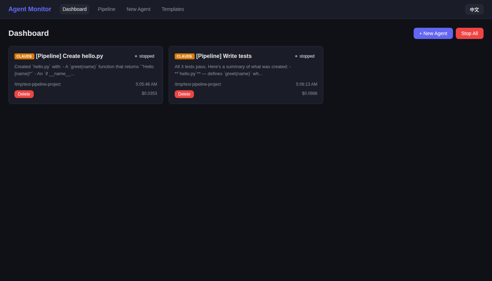
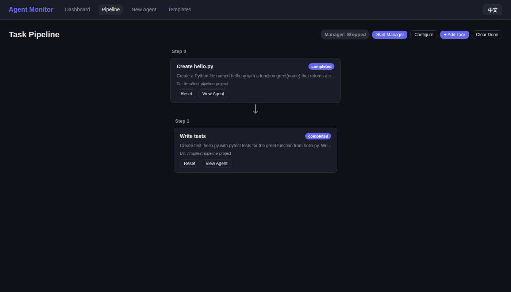
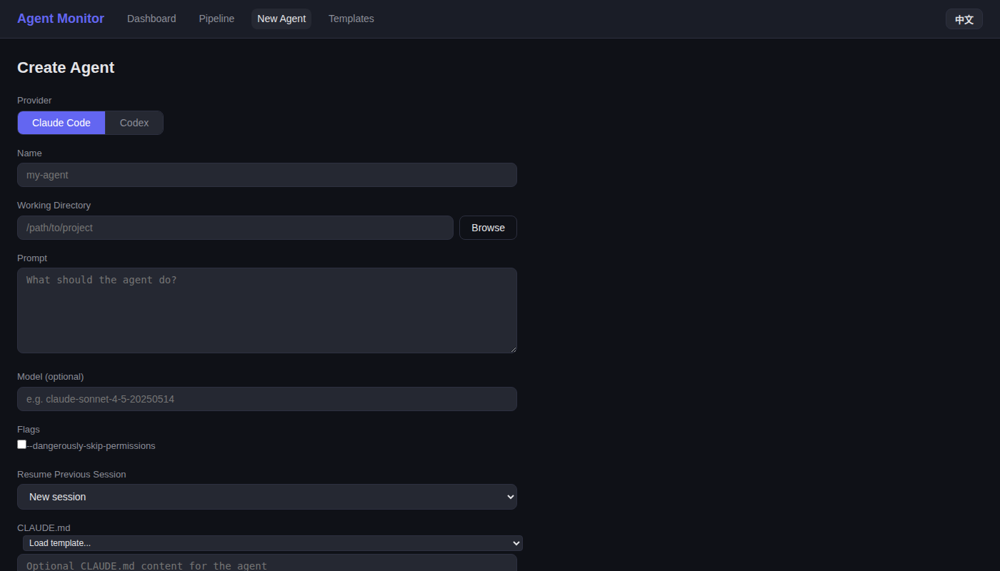
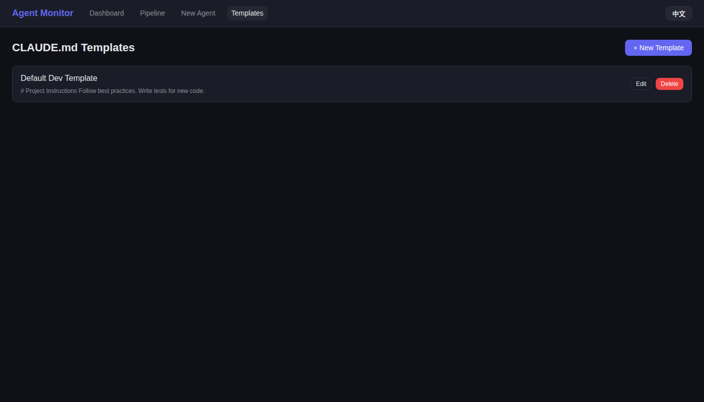
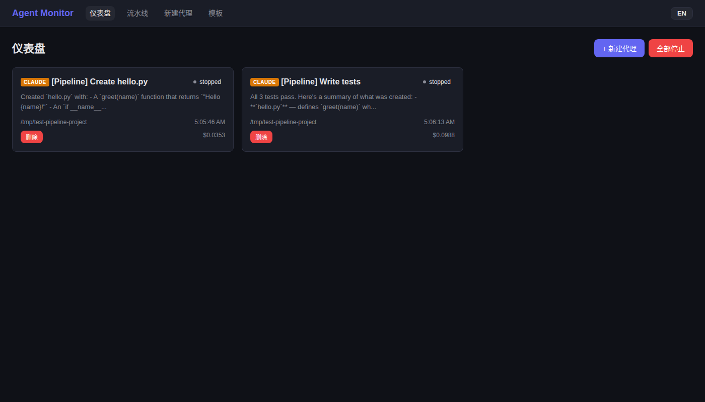

# Agent Monitor

[](LICENSE)
[](https://nodejs.org/)
[](https://www.typescriptlang.org/)
[](https://react.dev/)
[](server/__tests__)

**Agent Monitor** is an enterprise-ready web platform for orchestrating, monitoring, and managing AI coding agents at scale. Deploy Claude Code and OpenAI Codex agents from a unified dashboard — with real-time observability, automated task pipelines, and instant notifications via **Email** and **WhatsApp**.

---

## Key Features

### Multi-Agent Orchestration
- **Unified dashboard** — Create, monitor, and manage Claude Code and Codex agents from a single interface
- **Task pipelines** — Define sequential and parallel task workflows; the built-in Meta Agent Manager automates execution end-to-end
- **Git worktree isolation** — Every agent operates in its own branch, preventing conflicts when multiple agents work in the same repository

### Real-Time Monitoring & Interaction
- **Live streaming** — Watch agent output in real-time over WebSocket
- **Web terminal** — Full chat interface with 25+ slash commands matching CLI behavior
- **Cost & token tracking** — Per-agent cost (Claude) and token usage (Codex) displayed in real time
- **Double-Esc interrupt** — Press Escape twice to send SIGINT to any running agent

### Notifications — Email & WhatsApp
Stay informed wherever you are. Agent Monitor sends instant notifications when agents need human attention.

| Channel | Provider | Setup |
|---------|----------|-------|
| **Email** | Any SMTP server (Gmail, Outlook, Mailgun, etc.) | Configure `SMTP_*` environment variables |
| **WhatsApp** | Twilio API | Configure `TWILIO_*` environment variables |

Notifications are triggered when:
- An agent enters `waiting_input` state and needs human intervention
- A pipeline task fails
- A stuck agent exceeds the configurable timeout threshold
- The entire pipeline completes

Both channels can be enabled simultaneously — configure an admin email and/or WhatsApp phone number per agent or globally for the Agent Manager.

> See the [Notifications Guide](docs/guide/notifications.md) for detailed setup instructions.

### Template & Instruction Management
- **CLAUDE.md templates** — Create reusable instruction sets and load them when spawning agents
- **Live editing** — Modify an agent's CLAUDE.md at any time without restarting
- **Session resume** — Pick up previous Claude Code sessions where they left off

### Internationalization
- Full **English** and **Chinese** localization
- One-click language toggle persisted across sessions

---

## Screenshots

| Dashboard | Task Pipeline |
|-----------|---------------|
|  |  |

| Create Agent | Templates |
|--------------|-----------|
|  |  |

| Chinese Language |
|------------------|
|  |

---

## Quick Start

### Prerequisites

- **Node.js** >= 18
- **Claude Code CLI** (`claude`) — for Claude agents
- **Codex CLI** (`codex`) — for Codex agents
- **Git** — for worktree isolation

### Installation

```bash
git clone <repo-url> && cd AgentMonitor
npm install
cd server && npm install && cd ..
cd client && npm install && cd ..
```

### Production

```bash
cd client && npx vite build && cd ..
cd server && npx tsx src/index.ts
```

Open **http://localhost:3456** in your browser.

### Development

```bash
npm run dev    # Starts server (tsx watch) + client (vite dev) concurrently
```

- Client dev server: http://localhost:5173 (proxies API to :3456)
- API server: http://localhost:3456

---

## Configuration

All configuration is via environment variables. Copy `.env.example` to `.env` and set the values you need.

### Server

| Variable | Default | Description |
|----------|---------|-------------|
| `PORT` | `3456` | Server port |
| `CLAUDE_BIN` | `claude` | Path to Claude CLI binary |
| `CODEX_BIN` | `codex` | Path to Codex CLI binary |

### Email Notifications (SMTP)

| Variable | Default | Description |
|----------|---------|-------------|
| `SMTP_HOST` | — | SMTP server hostname (e.g., `smtp.gmail.com`) |
| `SMTP_PORT` | `587` | SMTP port (`587` for STARTTLS, `465` for TLS) |
| `SMTP_SECURE` | `false` | Set `true` for port 465 |
| `SMTP_USER` | — | SMTP username |
| `SMTP_PASS` | — | SMTP password or app-specific password |
| `SMTP_FROM` | `agent-monitor@localhost` | Sender address |

### WhatsApp Notifications (Twilio)

| Variable | Default | Description |
|----------|---------|-------------|
| `TWILIO_ACCOUNT_SID` | — | Twilio Account SID |
| `TWILIO_AUTH_TOKEN` | — | Twilio Auth Token |
| `TWILIO_WHATSAPP_FROM` | — | WhatsApp-enabled Twilio phone number (e.g., `+14155238886`) |

> If SMTP or Twilio credentials are not set, the respective notification channel is disabled gracefully — events are logged to the server console.

---

## Usage

### Creating an Agent

1. Click **"+ New Agent"** on the Dashboard
2. Select **Provider** — Claude Code or Codex
3. Set **Name**, **Working Directory**, and **Prompt**
4. Configure **Flags** (e.g., `--dangerously-skip-permissions`)
5. Optionally load a **CLAUDE.md template**
6. Enter an **Admin Email** and/or **WhatsApp Phone** for notifications
7. Click **Create Agent**

### Dashboard

Agents appear as status cards showing provider, status, latest output, and cost. Click any card to open the full chat interface.

### Agent Chat

Send messages, view conversation history, interrupt with Double-Esc, and use slash commands:

`/help` `/clear` `/status` `/cost` `/stop` `/compact` `/model` `/export`

### Task Pipeline

Orchestrate multi-step workflows with sequential and parallel task definitions. The Meta Agent Manager automatically provisions agents, monitors progress, sends notifications on failures, and cleans up on completion.

### Templates

Create, edit, and reuse CLAUDE.md instruction templates across agents.

---

## API Reference

### Agents

| Method | Endpoint | Description |
|--------|----------|-------------|
| GET | `/api/agents` | List all agents |
| GET | `/api/agents/:id` | Get agent details |
| POST | `/api/agents` | Create agent |
| POST | `/api/agents/:id/stop` | Stop agent |
| POST | `/api/agents/:id/message` | Send message |
| POST | `/api/agents/:id/interrupt` | Interrupt agent (SIGINT) |
| PUT | `/api/agents/:id/claude-md` | Update CLAUDE.md |
| DELETE | `/api/agents/:id` | Delete agent |
| POST | `/api/agents/actions/stop-all` | Stop all agents |

### Pipeline Tasks

| Method | Endpoint | Description |
|--------|----------|-------------|
| GET | `/api/tasks` | List pipeline tasks |
| POST | `/api/tasks` | Create task |
| DELETE | `/api/tasks/:id` | Delete task |
| POST | `/api/tasks/:id/reset` | Reset task status |
| POST | `/api/tasks/clear-completed` | Clear completed/failed tasks |
| GET | `/api/meta/config` | Get meta agent config |
| PUT | `/api/meta/config` | Update meta agent config |
| POST | `/api/meta/start` | Start meta agent manager |
| POST | `/api/meta/stop` | Stop meta agent manager |

### Templates

| Method | Endpoint | Description |
|--------|----------|-------------|
| GET | `/api/templates` | List templates |
| GET | `/api/templates/:id` | Get template |
| POST | `/api/templates` | Create template |
| PUT | `/api/templates/:id` | Update template |
| DELETE | `/api/templates/:id` | Delete template |

### Other

| Method | Endpoint | Description |
|--------|----------|-------------|
| GET | `/api/sessions` | List previous Claude sessions |
| GET | `/api/directories?path=/home` | Browse server directories |
| GET | `/api/health` | Health check |

### Socket.IO Events

| Event | Direction | Description |
|-------|-----------|-------------|
| `agent:join` | Client → Server | Subscribe to agent messages |
| `agent:leave` | Client → Server | Unsubscribe |
| `agent:send` | Client → Server | Send message |
| `agent:interrupt` | Client → Server | Send interrupt |
| `agent:message` | Server → Client | Agent output |
| `agent:status` | Server → Client | Status change |
| `task:update` | Server → Client | Pipeline task updated |
| `pipeline:complete` | Server → Client | Pipeline complete |
| `meta:status` | Server → Client | Meta agent status |

---

## Provider Support

| | Claude Code | Codex |
|---|---|---|
| **Binary** | `claude` | `codex` |
| **Flags** | `--dangerously-skip-permissions`, `--resume`, `--model` | `--dangerously-bypass-approvals-and-sandbox`, `--full-auto`, `--model` |
| **Tracking** | Cost (USD) | Token usage |

---

## Testing

```bash
npm test    # 40 tests
```

---

## Architecture

```
AgentMonitor/
  server/                   # Node.js + Express + Socket.IO
    src/
      services/
        AgentProcess.ts     # CLI process wrapper
        AgentManager.ts     # Agent lifecycle
        MetaAgentManager.ts # Pipeline orchestration
        WorktreeManager.ts  # Git worktree ops
        EmailNotifier.ts    # SMTP email notifications
        WhatsAppNotifier.ts # Twilio WhatsApp notifications
        SessionReader.ts    # Session history
        DirectoryBrowser.ts # Directory listing
      store/AgentStore.ts   # JSON persistence
      routes/               # REST endpoints
      socket/handlers.ts    # WebSocket handlers
    __tests__/              # Test suite
  client/                   # React + Vite
    src/
      pages/                # Dashboard, Chat, Pipeline, Templates
      i18n/                 # EN / ZH localization
      api/                  # REST + Socket.IO clients
```

---

## License

MIT
